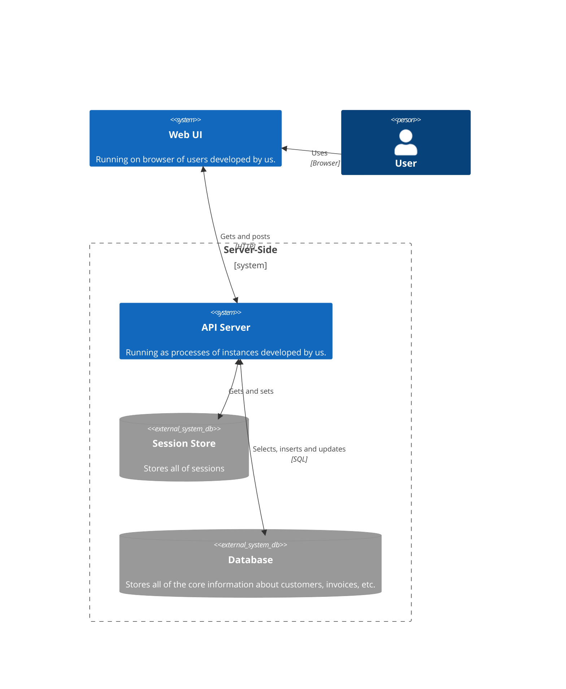
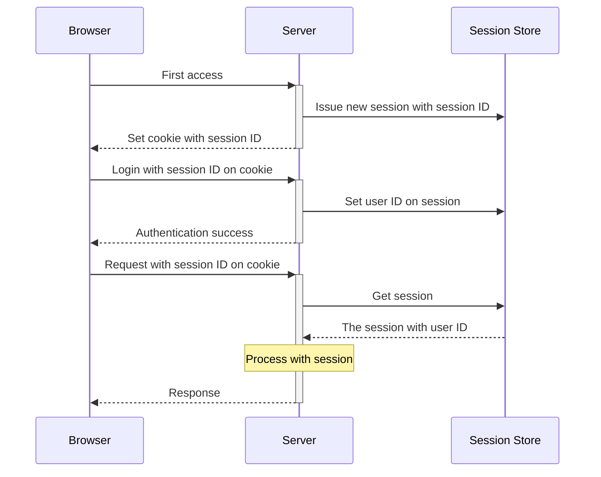
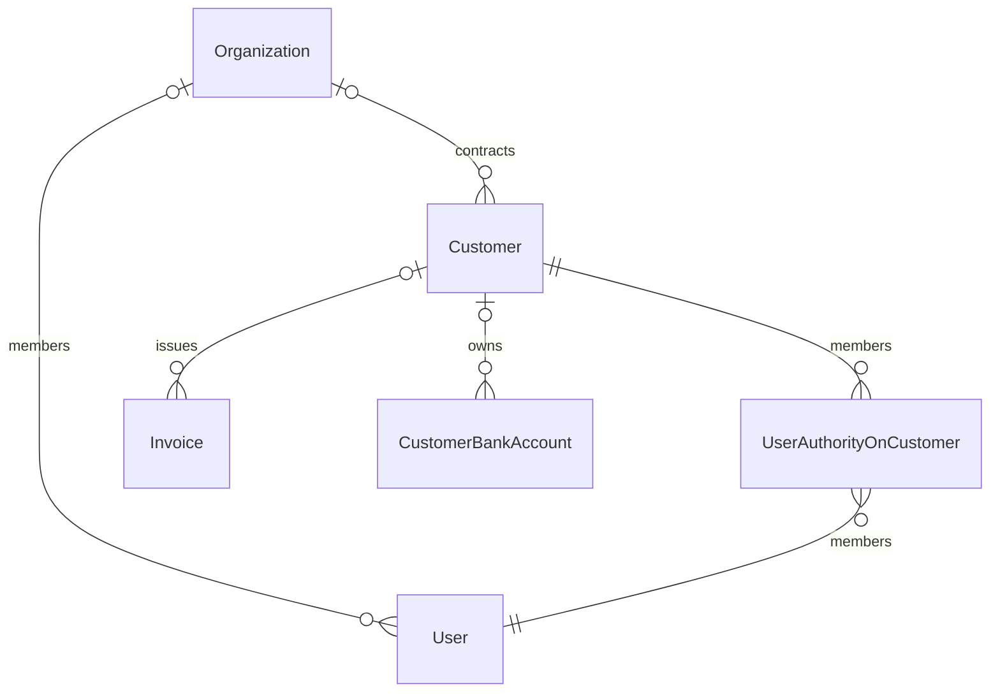

# Design

## アーキテクチャ

### 認証

### 認可

ユーザは、所属する企業 (organization)、取引先 (customer) から辿れるリソースに対して、企業、取引先毎の権限で許可された操作のみ行える。

企業毎権限:

* Admin: 企業の管理者権限。取引先毎権限 (UserAuthorityOnCustomer) を無視し、企業に紐づくリソースに対して、全ての操作が許可される。
* Member: 企業の一般権限。取引先毎権限による取引先への操作と、企業に対する一部操作が許可される。

取引先毎権限:

* Operator: 業務権限。取引先に紐づくソースに対して、書込・読込両方の操作が許可される。
* Viewer: 閲覧権限。取引先に紐づくソースに対して、読込操作が許可される。

詳しくは、[`app/controllers/concerns/user_authority_actions.rb`](./app/controllers/concerns/user_authority_actions.rb) を参照。

## ドメインの補完

### 補完事項

* 支払い期日までの猶予として、3日を必要とする仕様に。
  - 土日を挟んだ場合、登録されてから即支払いでは支払い期日に間に合わない可能性がある。
  - 確実な支払いを保証するためにも、猶予期間の設定は必要だと思われる。
  - ただし、この仕様は即振込を必要とするユーザの要望に応えられない可能性もあるため、より支払条件に関する制約を明確化し、支払先に応じて必要最低限の猶予期間に修正するのが望ましい。
* 手数料計算は、支払金額の4%小数点以下切り捨てとする。
  - 小数点以下の支払いは対応してないところが多いし、計上時にも扱いづらいと思われる為。
  - 蛇足: ビジネス的には、固定額 + 3%小数点以下切り捨てとか、一定金額まで固定額でその後4%以上とかの方がいい気はする？
* 手数料税額計算は、手数料の10%小数点以下切り捨てとする。
  - 現在の税法上の計算方法に則る。

### 足りないもの

* 請求書に対しての支払い先設定
  - 取引先毎に有効な支払い先を一意にしか設定できないようにする、もしくは請求書作成時に支払い先を設定するのどちらかをしないと支払い先が特定できない。
  - 支払いに関する証跡のためにも、支払い後支払先がどこだったかの記録を請求書データに残すことが望ましい。
  - 今回は支払先に関する詳細なドメインが不明確なため、ひとまず請求書に対しての支払い先の特定はスコープ外としている。
* 取引先銀行口座の審査状態
  - 犯罪収益移転防止法対応のため取引先銀行口座は基本的に審査が挟まることが多い。また、口座情報誤入力の可能性もあるため事前に少額振込などの確認が挟まれることも多い。
  - 支払期日での確実な支払いを保証するためには、支払先の確認が終了したタイミングで請求書作成を解放できることが望ましい。
  - 今回は、銀行口座に関する審査フローが不明確なため、ひとまず口座の審査状態に関してはスコープ外としている。

### スコープ外

* 認証機能強化
  - メールアドレスの確認、2段階認証、ログイン通知、生きてるセッションの管理、セッションの有効期間管理などはした方が良いが今回は主題ではないのでスコープ外。
  - CSRF は、認証必須で、認証情報を HTTP only cookie で管理しており、cookie を samesite=lax の範囲で管理していて、ブラウザの実装がちゃんとしてる前提の元では考えなくて良いので、今回はスコープ外。
* ちゃんとした UI/UX を持つクライアント
  - 今回は主題ではない為、最低限動作感を持つためだけのクライアントにして時間はかけない。
* 詳細なバリデーションエラー
  - ユーザヒントのためのバリデーションは基本的にクライアント側で行う想定。
  - サーバ側は、認可が通って以降、サーバ側でしか分からないかつ外部に出していい場合のみエラー内容を返す。
